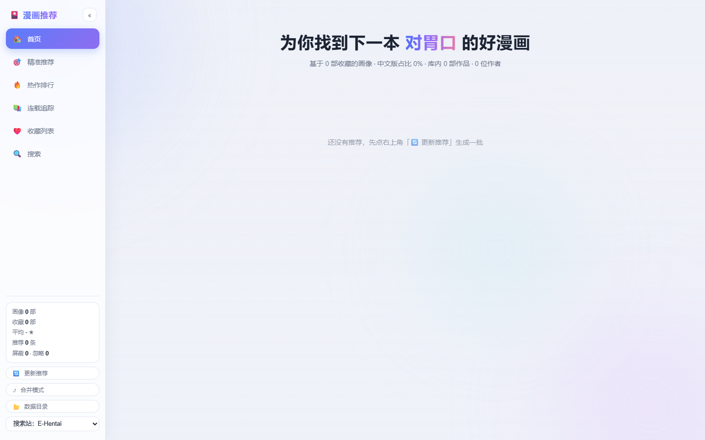

# 18x Manga Sommelier 🎴

**A personal, taste-driven recommendation system for adult manga.**

It reads the list of comics you already own, builds a *taste profile* from their
E-Hentai metadata (authors, tags, ratings, page counts), and then hunts across
multiple sites for works you don't own yet — with covers, direct links and an
AI-written, critic-style reason explaining *what the work itself is like*.

Everything runs locally. It queries **metadata and links only** — it never
downloads content, never bypasses DRM or paywalls, and never uploads anything.

> Language / 语言: English | [简体中文](README.zh-CN.md)



---

## ⚠️ Disclaimer

- This project is for **adults only (18+)**. All target sites host adult content.
- It is a **personal recommendation tool**, not a scraper or downloader.
- No content is downloaded, stored or redistributed. Only public metadata
  (titles / authors / tags / ratings / page counts) and gallery links are used.
- Built-in rate limiting respects each site's API policy. Don't lower it.
- Please support the artists you like.

---

## How it works

```
folder_list.txt (GBK, your own folder names)
        │  1. parse      structural entries (circle / artist / title / lang / volume)
        ▼
E-Hentai lookup          rule matching + optional DeepSeek disambiguation
        │  2. lookup     → gid / tags / rating / pages per work
        ▼
preference profile       3. profile   → TOP authors & tags, rating/length/category stats
        ▼
recommender (3 channels) 4. recommend → candidates from multiple sites, scored
        │                   against your profile, hard filters + penalties
        ▼
web UI / window app      5. serve|app → browse, like/meh/hide, merge, search, re-run
        │
feedback loop            6. feedback  → likes/mehs feed back into profile weights
```

### The three recommendation channels

| Channel | Quota | Logic |
|---|---|---|
| 🎯 Precision | 10 / batch | Searches each of your TOP authors and TOP tag combinations on every site |
| 🔥 Trending | 10 / batch | Popular works that **must** hit your TOP authors or TOP tags (hard filter) |
| 📚 Series | unlimited | Finds new volumes of series you already own |

Each refresh produces a **fresh batch** (old batches retire automatically), and
works published since your last refresh get a recency bonus. Works you already
liked / marked meh / hid are excluded across sites, and works you've already
been recommended are strongly deprioritized.

### Built-in taste rules (all configurable)

- Require Chinese editions (`require_chinese`)
- Hard-exclude categories / tags / title patterns (e.g. 3D, AI-generated, cosplay, live-action)
- Soft penalties (e.g. NTR variants)

### AI (optional)

[DeepSeek](https://platform.deepseek.com/) `deepseek-chat` is used — if a key is
configured — for: search-query expansion, ambiguous title disambiguation,
match verification, and the critic-style reasons. **Without a key everything
degrades gracefully to rule-based/template behavior.**

---

## Getting started (from source, Windows)

> Requirements: Windows 10/11, Python 3.10–3.13, and (for the window mode)
> Microsoft Edge / WebView2 runtime.

```bat
git clone https://github.com/myainygem/18x-manga-sommelier.git
cd 18x-manga-sommelier
python -m venv .venv
.venv\Scripts\activate
pip install -r requirements.txt
copy config.example.json config.json
```

Edit `config.json`:

```jsonc
{
  "proxy": "",                       // e.g. "http://127.0.0.1:7897" if you use Clash
  "ai": {
    "enabled": true,
    "api_key": "sk-...",             // DeepSeek key (optional)
    "model": "deepseek-chat"
  }
}
```

Prepare `folder_list.txt` — one entry per line, **GBK encoded**, exactly as your
comic folders are named (fictional example):

```
[circle (artist)] Work Title CH.1 [Chinese] [Digital]
(artist) Another Work [Chinese]
```

Then run the pipeline:

```bat
python cli.py check                    # environment self-check (sites, AI key)
python cli.py parse                    # parse folder_list.txt
python cli.py lookup                   # match every entry to E-Hentai metadata (long)
python cli.py auto-resolve             # (optional) AI-assisted pass for unmatched entries
python cli.py profile                  # build the taste profile
python cli.py recommend                # generate recommendations (reports/ folder)
python cli.py serve                    # browser UI at http://127.0.0.1:8765
python cli.py app                      # native window (WebView2), no browser
```

See [docs/INSTALL.md](docs/INSTALL.md) for the full walkthrough, including
cookie notes for 18comic and the portable/installer packaging.

---

## Web UI

The UI is a single-page app (light glassmorphism theme, Chinese display):

- **Home** — diagonal cover marquee + profile summary
- **Recommendation channels** — precision / trending / series cards with covers,
  Chinese tag names, separate 简介 (synopsis) and 推荐理由 (critique)
- **Feedback** — like / meh / hide with 5-second undo, manual cross-site merge
  with undo, like toggle
- **Library** — your collection grouped by merged author aliases, plus
  hand-liked works; remove / restore entries
- **Search** — cross-site search with per-site result totals, one-click
  favorite, cover proxy for hotlink-protected image hosts
- **Update** — pick sites, run a new batch in the background, watch the log

## CLI reference

| Command | Purpose |
|---|---|
| `python cli.py check [--ai]` | Environment self-check |
| `python cli.py parse` | Parse `folder_list.txt` (GBK) |
| `python cli.py lookup [--limit N] [--reset-manual] [--reset-all]` | Match entries to E-Hentai metadata (resumable) |
| `python cli.py auto-resolve [--max N]` | AI-assisted multi-language matching for leftovers |
| `python cli.py manual-pick LINE [INDEX]` | Manually confirm a lookup candidate |
| `python cli.py verify-ai [--max N]` | Re-verify AI matches, demote wrong ones |
| `python cli.py profile` | (Re)build the preference profile |
| `python cli.py recommend [--sites ehentai,nhentai] [--no-ai] [--force]` | Generate a recommendation batch |
| `python cli.py series-check` | Series channel only |
| `python cli.py feedback WORK_ID like\|meh\|hide` | Record feedback from the CLI |
| `python cli.py update-profile` | Apply pending feedback weights (UI does this on refresh) |
| `python cli.py enrich` / `regen-reasons` | Backfill favcount/synopsis / rewrite reasons |
| `python cli.py backfill-covers` / `purge-dupes` | Cover backfill / library-duplicate cleanup |
| `python cli.py jm-login` | Interactive 18comic cookie setup (reads Chrome cookies) |
| `python cli.py serve` / `app` | Browser UI / native window |
| `python cli.py status` | Library / profile / recommendation stats |

## Configuration reference

`config.json` (see `config.example.json` for defaults):

| Key | Meaning |
|---|---|
| `proxy` | HTTP(S) proxy for blocked sites, e.g. `http://127.0.0.1:7897` |
| `rate_limits.*` | Per-domain minimum interval in seconds |
| `sites.*` | Enable/disable ehentai / nhentai / wnacg / 18comic / hitomi |
| `ai.enabled` / `api_key` / `model` | DeepSeek config (`DEEPSEEK_API_KEY` env var wins) |
| `ai.search_expand` / `disambiguate` / `reasons` | Which AI features are on |
| `recommend.quota_precision` / `quota_trending` / `quota_series` | Batch sizes (`0` = unlimited) |
| `recommend.min_score` | Cutoff for picking |
| `recommend.prefer_recent_since_last` | Bonus for works published since last refresh |
| `filters.require_chinese` | Only recommend Chinese editions |
| `filters.hard_exclude_categories` / `hard_exclude_tags` / `title_regex_exclude` | Hard filters |
| `filters.penalty_tags` | Score penalties |
| `ui.search_site` | Default "search in site" target for tag clicks |

## Supported sites

| Site | Role | Notes |
|---|---|---|
| E-Hentai | primary metadata source | search + gdata API, 7 s rate limit |
| nhentai | recommendations / search | official v2 API via curl_cffi Chrome impersonation (plain requests gets 403) |
| wnacg 绅士漫画 | Chinese editions | HTML parsing |
| 18comic 禁漫 | Chinese editions | jmcomic APP API client |
| hitomi.la | search / optional recommend | JS-rendered search via headless Chrome; slow |

## Data & privacy

- All data lives in the project `data/` directory (SQLite database, profile
  JSON, caches). Nothing is sent anywhere except the site metadata/API queries
  and — only if you configured a key — the DeepSeek API calls.
- `config.json`, `folder_list.txt` and everything under `data/` (except the
  public `tag_zh.json` translation resource) are git-ignored. **Never commit
  your library data or API keys.**
- Portable mode: drop a `portable.flag` next to the packaged `MangaRecV1.exe`
  and all data/config live in that same folder — nothing touches `%APPDATA%`.

## Packaging (Windows)

```bat
pip install -r requirements-build.txt
pyinstaller manga_rec_v1.spec --noconfirm                          # → dist\MangaRecV1\
"<Inno Setup 6>\ISCC.exe" installer\manga_rec_v1_release.iss       # → release\
```

The spec bundles a **clean seed** (empty config, no library data) — see the
`onlyifdoesntexist` rules in the Inno script: re-running the installer never
overwrites user config/data.

## Releases

See [Releases](https://github.com/myainygem/18x-manga-sommelier/releases):

- **`MangaRecV1-Setup-1.0.0.exe`** — windowed V1 app (WebView2), ships with an
  empty library. Building your own personal library is done with the CLI from
  source (see above); the installer is a convenient way to run the UI.

## Known limitations

- Hitomi search is browser-rendered and slow; enabling it in recommendations
  noticeably lengthens runs.
- Kanji-only titles without kana are not romanized (accepted trade-off).
- The pipeline is Windows-first (the author develops on Windows).

## Roadmap

- [ ] In-app library import (parse folder list from the UI)
- [ ] More sites and better cross-site identity matching
- [ ] English UI locale
- [ ] Linux support

## Open-source acknowledgements

Built on top of these open-source projects:

| Project | Purpose | License |
|---|---|---|
| [requests](https://github.com/psf/requests) | HTTP client | Apache-2.0 |
| [curl_cffi](https://github.com/lexiforest/curl_cffi) | TLS fingerprint impersonation (nhentai) | MIT |
| [pykakasi](https://github.com/miurahr/pykakasi) | Japanese kana/kanji romanization | GPL-3.0-or-later |
| [OpenCC](https://github.com/BYVoid/OpenCC) | Simplified/Traditional Chinese conversion | Apache-2.0 |
| [jmcomic (JMComic-Crawler-Python)](https://github.com/tonquer/jmcomic) | 18comic APP API client | MIT |
| [playwright](https://github.com/microsoft/playwright-python) | Headless browser (hitomi search, cookie login) | Apache-2.0 |
| [pywebview](https://github.com/r0x0r/pywebview) | Native window (WebView2) | BSD-3-Clause |
| [pythonnet](https://github.com/pythonnet/pythonnet) | .NET interop (WebView2) | MIT |
| [clr-loader](https://github.com/pythonnet/clr-loader) | .NET runtime loading | MIT |
| [pywin32](https://github.com/mhammond/pywin32) | Windows API (Chrome cookie decryption) | PSF |
| [PyInstaller](https://github.com/pyinstaller/pyinstaller) | Packaging | GPL-2.0-or-later (with exception) |
| [Inno Setup](https://jrsoftware.org/isinfo.php) | Installer authoring | Freeware |

Also thanks to [DeepSeek](https://platform.deepseek.com/) for the optional AI
service, and to E-Hentai, nhentai, wnacg, 18comic and hitomi for the public
metadata this tool queries.

## License

[MIT](LICENSE) © 2026 myainygem
